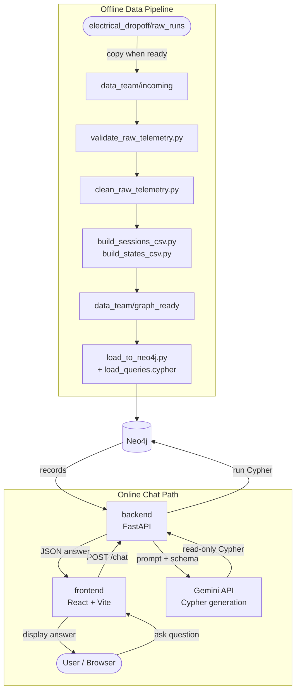
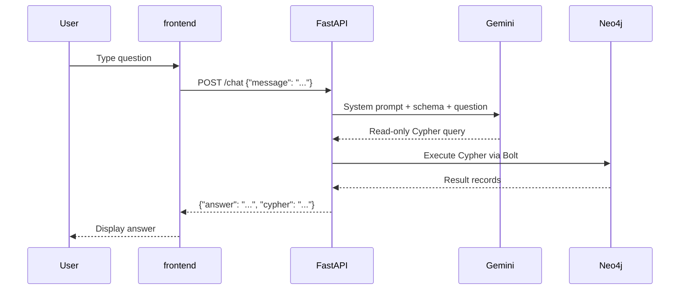

# System Overview

This project has two distinct tracks that share a single Neo4j graph database: an **offline data pipeline** that builds the graph, and an **online chat path** that queries it.

## Full system diagram



## Offline track (data pipeline)

Raw telemetry files from the electrical team flow through validation, cleaning, and CSV-building scripts maintained by the data team. The final step loads graph-ready data into Neo4j, creating nodes and relationships that represent sessions, laps, metrics, and their connections.

**Ownership:** Electrical team drops files; data team runs the pipeline and defines the graph schema.

## Online track (chat)

When a user asks a question in the browser, the frontend sends a `POST /chat` request to FastAPI. The backend passes the question (plus the graph schema) to Gemini, which returns a read-only Cypher query. The backend executes that Cypher against Neo4j, formats the results, and returns a JSON answer to the UI.

**Ownership:** Software team builds and maintains the frontend, API, and Gemini integration.

## Chat request lifecycle



## Running locally

Start all three services with one command from the repo root:

```bash
docker compose up --build
```

Full command reference: see [infra/docker/README.md](../../infra/docker/README.md).
